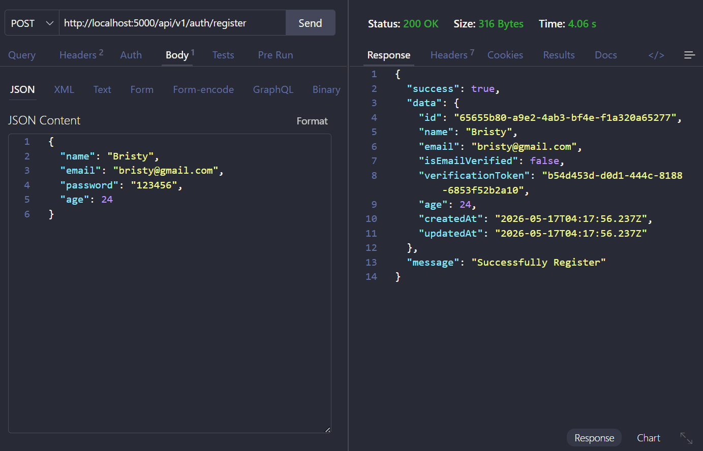
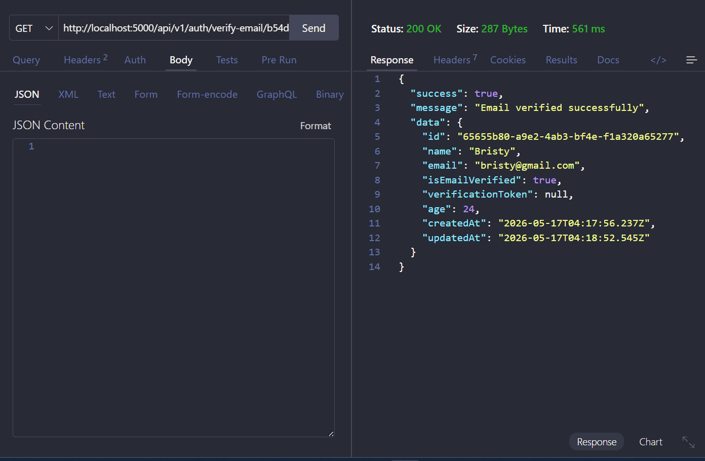
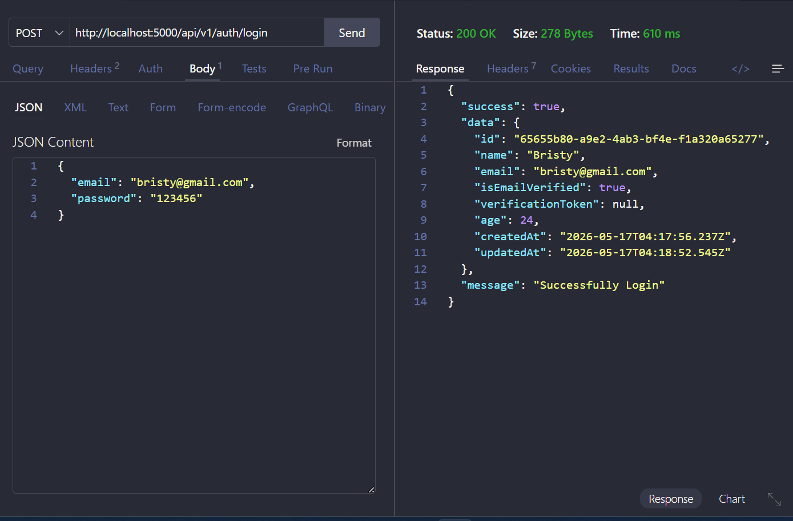

## Screenshots

### Register

### Email Verify

 
### Login
 

PORT=your_port
NODE_ENV=your_node_env 

DATABASE_URL=your_database_uri 

EMAIL_USER=your_email 
EMAIL_PASS=your_app_password 
 
MONGO_URI=your_mongo_uri   
 
What is the difference between Primary Key and Foreign Key?  
Ans: A Primary Key is a column or a combination of columns used to uniquely identify every single record in a database table. It must contain completely unique values and can never accept NULL values, with a strict rule of only one primary key per table. On the other hand, a Foreign Key is used to link two tables together by referencing the primary key of another table. Unlike primary keys, foreign keys can accept duplicate and NULL values, and a single table can contain multiple foreign keys to establish relationships with various tables, thereby maintaining referential integrity across the database. 

Why is normalization important?
Ans: Normalization is a systematic database design technique used to organize data into multiple tables to minimize redundancy and eliminate undesirable characteristics like insertion, update, and deletion anomalies. By breaking down large, monolithic tables into smaller, isolated ones and defining clear relationships between them, normalization ensures that every piece of data is stored in exactly one place. This prevents data inconsistency—such as updating a user's phone number in one place but having it remain outdated in another—and significantly reduces the storage footprint of the database.
 
What is a JOIN?
Ans: A JOIN clause in SQL is a mechanism used to combine and retrieve rows from two or more tables simultaneously, based on a related, shared column between them. When querying a normalized database where information is split across multiple tables, joins allow you to stitch that data back together into a single result set. The most common types are Inner Joins, which return only the rows that have matching values in both tables, and Left Joins, which return all records from the primary left table along with any matching records from the right table, filling in NULL values if no match exists.

Difference between SQL and MongoDB?
Ans: The fundamental difference lies in their underlying architecture and data modeling. SQL databases are relational systems that store data in structured, rigid tables with fixed rows and columns, requiring a predefined, strict schema and using SQL for complex, multi-table transactions. MongoDB, by contrast, is a non-relational, document-oriented NoSQL database that stores data as flexible, schema-less JSON-like documents, allowing related data to be nested hierarchically inside a single record. While SQL databases typically scale vertically by upgrading a single server's hardware, MongoDB is designed to scale horizontally across multiple servers out of the box. 

What is a composite key?
Ans: A Composite Key is a type of primary key that is composed of two or more columns instead of a single field. It is utilized when no single column in a table possesses enough distinct data to uniquely identify a record, but combining the specific attributes guarantees a completely unique identifier. For example, in a junction table tracking student course enrollments, neither the student_id nor the course_id is unique on its own because a student can take multiple courses and a course has multiple students, but the combined pair of student_id and course_id will always be unique for an individual enrollment.

What is a weak entity?
Ans: In database modeling, a Weak Entity is an entity that cannot be uniquely identified by its own attributes alone and completely relies on its relationship with a parent, or strong entity, to exist. It lacks a primary key of its own and instead uses a partial key, or discriminator, alongside the parent's foreign key to form its identity. A classic example is an account's Dependents table for insurance; a dependent's record has no meaning or independent existence in the system if the primary employee or policyholder record is deleted from the database.

Why do we use constraints?
Ans: We use Constraints in databases to enforce specific rules and restrictions on the data entering a table, ensuring overall data integrity, accuracy, and reliability at the database level. By embedding business logic directly into the schema via constraints like NOT NULL, UNIQUE, and CHECK, the database acts as a final line of defense against corrupted, invalid, or missing data. This prevents bad data from ever being written to disk, regardless of any bugs or missing validation logic in the frontend or backend application code.

Explain many-to-many relationship.
Ans:A Many-to-Many relationship occurs when multiple records in one database table are associated with multiple records in another table. Because relational databases cannot directly map this type of multi-directional link between two tables, developers implement this by introducing a third table known as a Junction Table or bridging table. This junction table breaks down the complex relationship into two separate one-to-many relationships by holding foreign keys that point directly to the primary keys of both parent tables, such as an Enrollments table connecting a Students table and a Courses table.

What is the difference between Clustered and Non-Clustered Index?
Ans: A Clustered Index dictates the literal, physical sorting order of the actual data rows inside a table based on the indexed column, acting much like an alphabetical phone book where the data itself is the index. Because data can only be physically sorted in one way on a disk, a table can only have one clustered index, which is automatically created on the primary key. In contrast, a Non-Clustered Index creates a separate, isolated structure that contains a copy of the indexed columns along with pointers or row locators back to the actual data, operating like an index at the back of a textbook and allowing you to create multiple indexes on a single table.

Explain Database Sharding and Partitioning. When would you use each?
ANs: Partitioning is the process of splitting a massive, unmanageable table into smaller, distinct logical subsets within the exact same database instance and server, making large datasets faster to query while keeping administration centralized. Sharding, on the other hand, is a form of horizontal scaling where data is divided and distributed across entirely separate physical database servers or machines, meaning each server only holds a fraction of the global dataset. You would use partitioning when a single table grows too large for fast indexing but your server still has plenty of CPU and RAM capacity; you would scale up to sharding when your data or transaction volume completely exhausts the hardware limits of a single physical machine.

What is the difference between:
-DELETE
-TRUNCATE
-DROP
Ans: These three commands differ primarily in their "destructiveness" and how they interact with the database log.
DELETE: A DML (Data Manipulation Language) command used to remove specific rows using a WHERE clause. It is slower because it logs every row deleted, allowing you to "Undo" (Rollback) the action.
TRUNCATE: A DDL (Data Definition Language) command that removes all rows from a table. It is faster than DELETE because it doesn't log individual row deletions. It resets the table but keeps the structure intact.
DROP: A DDL command that completely removes the entire table structure and all its data from the database. The table ceases to exist.

What is a PRIMARY KEY?
Ans: A PRIMARY KEY is a constraint that uniquely identifies each record in a table. It must contain unique values and cannot contain NULL values. Think of it like a Social Security Number or a Student ID; it ensures no two rows are identical.

What is the difference between:
-PRIMARY KEY
-UNIQUE KEY
Ans: A Primary Key is a constraint used to uniquely identify each record in a database table; it must contain unique values and strictly prohibits NULL entries. Each table is limited to exactly one Primary Key, which typically serves as the "anchor" for relationships with other tables. In contrast, a Unique Key also ensures that all values in a column are distinct, but its primary purpose is to prevent duplicate data rather than to identify the row itself. Unlike the Primary Key, you can apply multiple Unique Keys to a single table, and most database systems allow a Unique Key column to store a single NULL value.

What is a FOREIGN KEY?
Ans: A FOREIGN KEY is a column (or group of columns) that provides a link between data in two tables. It refers to the PRIMARY KEY of another table. This creates a "Parent-Child" relationship, ensuring referential integrity (you can't have an order for a customer who doesn't exist).

What is JOIN in SQL?
Explain:
-INNER JOIN
-LEFT JOIN
Ans: JOINs are used to combine rows from two or more tables based on a related column between them.
INNER JOIN: Returns records that have matching values in both tables. If a row in Table A doesn't have a match in Table B, it is excluded.
LEFT (OUTER) JOIN: Returns all records from the left table, and the matched records from the right table. If there is no match, the result is NULL on the right side.

What is normalization?
Explain:
-1NF
-2NF
-3NF
Ans: Normalization is the process of organizing data to reduce redundancy (repetition) and improve data integrity.
1NF (First Normal Form): Data must be atomic (one value per cell) and each record must be unique.
2NF (Second Normal Form): Must be in 1NF, and all non-key columns must depend on the entire primary key.
3NF (Third Normal Form): Must be in 2NF, and no column should depend on another non-key column (no transitive dependencies).

What is indexing?Why do we use index?
Ans:An Index is a data structure (usually a B-Tree) that improves the speed of data retrieval operations.
Why use it? Without an index, the database must perform a "Full Table Scan" (reading every single row). With an index, the database can jump directly to the data, much like using an Index at the back of a textbook to find a specific page.

What is the difference between:
WHERE
HAVING
Ans:WHERE: Used to filter records before any groupings are made. It works on individual rows.
HAVING: Used to filter records after an aggregation (like SUM or COUNT) has been performed. It is almost always used with the GROUP BY clause.

What is a transaction in SQL?
Explain:
-COMMIT
-ROLLBACK
Ans: A Transaction is a single unit of work. It follows the "all or nothing" rule.
COMMIT: Saves all changes made during the transaction permanently to the database.
ROLLBACK: Undoes the changes made during the transaction, returning the database to its previous state (useful if an error occurs).

Write a query to find the second highest salary. 
Ans: SELECT MAX(Salary) 
FROM Employees 
WHERE Salary < (SELECT MAX(Salary) FROM Employees);

What is Prisma ORM and why is it used in backend development?
Ans:Prisma ORM is a lightweight, next-generation tool for Node.js and TypeScript that bridges the gap between your backend code and your database. Instead of forcing you to write raw, complex SQL queries by hand, Prisma allows you to interact with your data using intuitive, object-oriented JavaScript methods. It uses a single configuration file to define your database structure, which acts as the ultimate source of truth for your entire application.
Backend developers choose Prisma primarily for its industry-leading type safety and automated tools. It automatically generates a custom database client that provides real-time code autocompletion and catches typos or data errors in your editor before your application even runs. Additionally, it features an automated migration system to safely update your database structure and includes a visual web dashboard to edit your data easily.
Ultimately, Prisma boosts development speed and app performance while minimizing code bugs. It runs on a highly optimized database engine that automatically handles complex relationships and minimizes slow queries. Because Prisma supports most major databases like PostgreSQL, MySQL, and MongoDB, it gives developers the flexibility to scale or switch their database setup with minimal code changes.

What is the difference between findUnique() and findFirst() in Prisma?
Ans:findUnique() searches strictly for a single record using fields that are explicitly marked with @id (Primary Key) or @unique constraints in your schema. Because it targets unique identifiers, it is highly optimized and fast.
findFirst() can search using any criteria or ordinary fields (like status: "active" or age: 25). It scans the database and returns the very first record that matches your filters, even if multiple matching records exist.

What is Prisma Migration and why is prisma migrate dev used?
Ans:Prisma Migration is a version-control system for your database that tracks and manages structural changes over time. Instead of writing manual SQL scripts to create or alter tables, you simply update your human-readable schema.prisma file. Prisma automatically detects these modifications and generates the chronological SQL migration history needed to keep your database structure perfectly aligned with your application code.
The command prisma migrate dev is specifically designed for local development environments to automate this workflow. When executed, it compares your schema file against your local database, automatically generates a new version-controlled SQL migration file, and applies those changes to update your database. Crucially, it also regenerates your Prisma Client immediately, ensuring your code editor instantly provides accurate TypeScript autocompletion and type-safety for your newly modified database structure.

Explain the difference between select and include in Prisma with examples.
Ans:In Prisma, select and include both shape your query results, but select is used to cherry-pick specific columns, while include is used to fetch related tables. When you use select, Prisma returns only the specific fields you explicitly set to true (e.g., select: { id: true, email: true }), completely hiding the rest of the record to keep data lightweight. Conversely, include returns all default fields of the main record while simultaneously pulling in related data from another table (e.g., include: { posts: true } to fetch a user along with all their articles). You choose select to filter down your columns and save bandwidth, and include when you want the full original object plus its connected relationships.

What is the purpose of the Prisma schema file (schema.prisma) and what are its main sections? 
Ans: The schema.prisma file is the central source of truth for a Prisma-backed application, serving to define your database configuration, connection settings, and data models in a single, human-readable file. It consists of three main sections: the datasource, which specifies your database provider (e.g., PostgreSQL) and connection URL; the generator, which instructs Prisma to create assets like the type-safe Prisma Client for your code; and the models, which define your database tables, their specific columns, data types, and relationships. By editing this single file, Prisma can automatically handle your database migrations and generate precise TypeScript types for your entire backend application.
